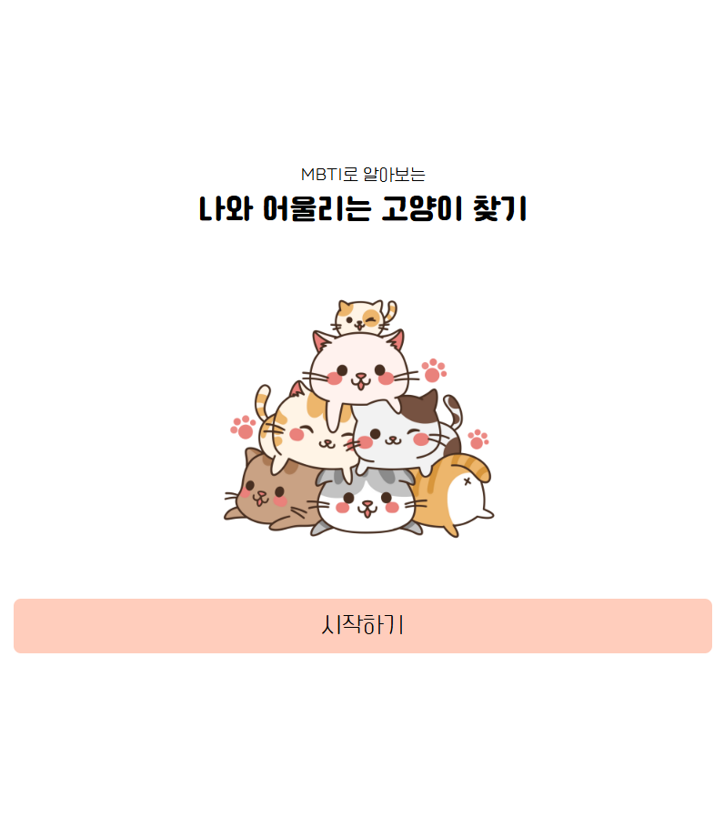

# 🐈 MBTI로 알아보는 나와 어울리는 고양이 찾기

---


### 📣 소개

12가지 질문을 통해서 나의 MBTI와 어울리는 고양이를 찾을 수 있는 재미있는 심리 테스트

[https://mbti-test-virid.vercel.app](https://mbti-test-virid.vercel.app/)


### ⚙️ 사용 기술

- `html` : 전반적인 웹 페이지의 구성
- `css` : 웹 페이지의 디자인을 위해 사용
- `Java Script` : `react`내에서 기능을 구현
- `react` : 웹 페이지 내의 매끄러운 전환과 유용한 기능을 넣기 위해 사용
- `Vite` : 빠른 실시간 반영 개발 서버

### 📖 Installation

1. Clone the repository

```bash
git clone https://github.com/JINJIYU23/mbti-test.git
cd my-mbti
```

1. 필요한 react 라이브러리 설치

```bash
npm install
```

1. 카카오톡 공유하기
- [https://developers.kakao.com/](https://developers.kakao.com/)에서 API key 발급
- 내 애플리케이션 생성 후, JavaScript 키 이용


```jsx
// (ResultPage.jsx)

  useEffect(() => {
    if (!Kakao.isInitialized()) {
      Kakao.init("JAVASCRIPT_KEY");
    }
  }, []);
```

- 카카오톡 탬플릿 ID 확인하기


```jsx
// (ResultPage.jsx)

const clickShareHandler = () => {
    Kakao.Share.sendCustom({
      templateId: TEMPLATE_ID,
      templateArgs: {
        THU: "https://mbti-test-virid.vercel.app" + resultMBTIData.image,
        MATCH_CAT: resultMBTIData.match_cat,
      },
    });
  };

```

1. 🎉 start MY MBTI **🎉**

[http://localhost:5173/](http://localhost:5173/)로 접속 가능!

```bash
npm run dev
```

---

### ✅결과



메인 화면


질문 화면


MBTI 에 따른 결과 화면


카카오톡으로 공유된 모습